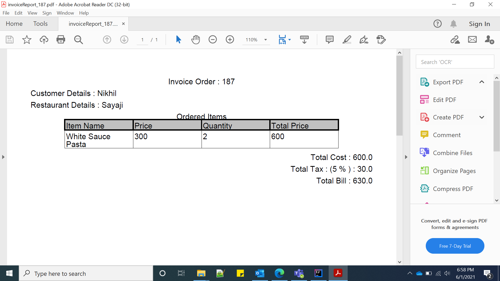

# Food-Order

# Create Restaurant
http://localhost:8082/restaurant/api/createRestaurant

##Request:
{
"id": 8,
"restaurantName": "Maa Ki Rasai",
"address": "Sudama Nagar, Indore, MP , 452009"
}

# Get the Restaurant details
http://localhost:8082/restaurant/api/getRestaurantById/8

##Response
{
"id": 8,
"restaurantName": "Maa Ki Rasai",
"address": "Sudama Nagar, Indore, MP , 452009"
}

# Create Menu for Restaurant
http://localhost:8082/restaurant/api/create/{restaurantId}/menu

##Request Url
http://localhost:8082/restaurant/api/create/8/menu

##Response
[
    {
    "id": 1,
    "restaurantId": 8,
    "name": "White Sauce Pasta",
    "description": "Italian Food",
    "price": 300,
    "quantity": 2
    }
]

# Create Order
http://localhost:8086/customer/api/createOrder

##Request
{
"addressInfo": {
"address1": "220, Dwarkapuri",
"address2": "Indore, MP, 452009",
"city": "Indore",
"state": "MP",
"zip": "452009"
},
"customerId": "2",
"deliveryTime": 20 mins,
"driverId": 3,
"id": "187",
"items": [
    {
    "name": "White Sauce Pasta",
    "price": 300,
    "quantity": 2
    }
],
"orderStatus": "CREATED",
"orderTime": date,
"restaurantId": "8",
"specialNote": "Make it Sweet as well as spicy",
"totalPrice": 600,
"unitPreparationTime": 15 min,
"userInfo": {
"firstName": "Nikhil",
"lastName": "Bhansali",
"phone": "9754258392"
}
}

#Response
{
"id": "187",
"restaurantId": "8",
"items": [
    {
    "name": "White Sauce Pasta",
    "price": 300,
    "quantity": 2
    }
],
"totalPrice": 600,
"orderTime": 1622553175487,
"specialNote": "Make it Sweet as well as spicy",
"deliveryTime": 20 mins,
"customerId": "2",
"unitPreparationTime": 15 min,
"orderStatus": "CREATED",
"driverId": 3,
"userInfo": {
"firstName": "Nikhil",
"lastName": "Bhansali",
"phone": "9754258392"
},
"addressInfo": {
"address1": "220, Dwarkapuri",
"address2": "Indore, MP, 452009",
"city": "Indore",
"state": "MP",
"zip": "452009"
}
}

##Get Total Fare and Estimated time to deliver
##Request
http://localhost:8086/customer/api/getTotalFare/187

##Response
Total fare::630 
Food Preparation Time::15 
Delivery Time::20

##IF Customer want to cancel the order
##Request
http://localhost:8086/customer/api/cancelOrder

##Response--Updated the order status to "CANCELLED"
{
"id": "187",
"restaurantId": "8",
"items": [
    {
    "name": "White Sauce Pasta",
    "price": 300,
    "quantity": 2
    }
],
"totalPrice": 600,
"orderTime": 1622553793717,
"specialNote": "Make it Sweet as well as spicy",
"deliveryTime": 20,
"customerId": "2",
"unitPreparationTime": 15,
"orderStatus": "CANCELLED",
"driverId": 3,
"userInfo": {
"firstName": "Nikhil",
"lastName": "Bhansali",
"phone": "9754258392"
},
"addressInfo": {
"address1": "220, Dwarkapuri",
"address2": "Indore, MP, 452009",
"city": "Indore",
"state": "MP",
"zip": "452009"
}
}

## Invoice-Service

##Generate Order Invoice Report
http://localhost:8083/order/api/getOrderById/{id}/orderInvoicePdf

#Request Url 
http://localhost:8086/order/api/getOrderById/187/orderInvoicePdf

#Response

Report has been generated 

# Driver Service

##Get the detail details and address details on the basis of ID
##RequestUrl
http://localhost:8085/driver/api/orderDetailAndAddressDetailById/{id}

##Response
{
"id": "187",
"restaurantId": "8",
"items": [
    {
    "name": "White Sauce Pasta",
    "price": 300,
    "quantity": 2
    }
],
"totalPrice": 600,
"orderTime": 1622553793717,
"specialNote": "Make it Sweet as well as spicy",
"deliveryTime": 20,
"customerId": "2",
"unitPreparationTime": 15,
"orderStatus": "CREATED",
"driverId": 3,
"userInfo": {
"firstName": "Nikhil",
"lastName": "Bhansali",
"phone": "9754258392"
},
"addressInfo": {
"address1": "220, Dwarkapuri",
"address2": "Indore, MP, 452009",
"city": "Indore",
"state": "MP",
"zip": "452009"
}
}

##Update the Order status to Picked-up
##RequestUrl
http://localhost:8085/driver/api/orderDelivered

{
"id": "187",
"restaurantId": "8",
"items": [
    {
    "name": "White Sauce Pasta",
    "price": 300,
    "quantity": 2
    }
],
"totalPrice": 600,
"orderTime": 1622553793717,
"specialNote": "Make it Sweet as well as spicy",
"deliveryTime": 20,
"customerId": "2",
"unitPreparationTime": 15,
"orderStatus": "PICKED-UP",
"driverId": 3,
"userInfo": {
"firstName": "Nikhil",
"lastName": "Bhansali",
"phone": "9754258392"
},
"addressInfo": {
"address1": "220, Dwarkapuri",
"address2": "Indore, MP, 452009",
"city": "Indore",
"state": "MP",
"zip": "452009"
}
}

##Response
{
"id": "187",
"restaurantId": "8",
"items": [
    {
    "name": "White Sauce Pasta",
    "price": 300,
    "quantity": 2
    }
],
"totalPrice": 600,
"orderTime": 1622553793717,
"specialNote": "Make it Sweet as well as spicy",
"deliveryTime": 20,
"customerId": "2",
"unitPreparationTime": 15,
"orderStatus": "PICKED-UP",
"driverId": 3,
"userInfo": {
"firstName": "Nikhil",
"lastName": "Bhansali",
"phone": "9754258392"
},
"addressInfo": {
"address1": "220, Dwarkapuri",
"address2": "Indore, MP, 452009",
"city": "Indore",
"state": "MP",
"zip": "452009"
}
}

##Update the Order status to Delivererd
##RequestUrl
http://localhost:8085/driver/api/orderDelivered

{
"id": "187",
"restaurantId": "8",
"items": [
    {
    "name": "White Sauce Pasta",
    "price": 300,
    "quantity": 2
    }
],
"totalPrice": 600,
"orderTime": 1622553793717,
"specialNote": "Make it Sweet as well as spicy",
"deliveryTime": 20,
"customerId": "2",
"unitPreparationTime": 15,
"orderStatus": "CREATED",
"driverId": 3,
"userInfo": {
"firstName": "Nikhil",
"lastName": "Bhansali",
"phone": "9754258392"
},
"addressInfo": {
"address1": "220, Dwarkapuri",
"address2": "Indore, MP, 452009",
"city": "Indore",
"state": "MP",
"zip": "452009"
}
}

##Response
{
"id": "187",
"restaurantId": "8",
"items": [
    {
    "name": "White Sauce Pasta",
    "price": 300,
    "quantity": 2
    }
],
"totalPrice": 600,
"orderTime": 1622553793717,
"specialNote": "Make it Sweet as well as spicy",
"deliveryTime": 20,
"customerId": "2",
"unitPreparationTime": 15,
"orderStatus": "DELIVERED",
"driverId": 3,
"userInfo": {
"firstName": "Nikhil",
"lastName": "Bhansali",
"phone": "9754258392"
},
"addressInfo": {
"address1": "220, Dwarkapuri",
"address2": "Indore, MP, 452009",
"city": "Indore",
"state": "MP",
"zip": "452009"
}
}